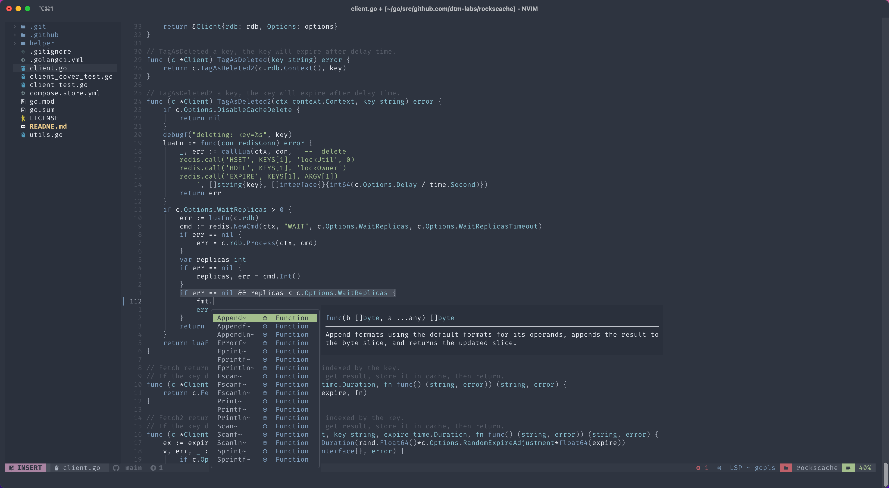

# nvchad-go

NvChad's custom files for Go developers.



## Pre-requisites

### Neovim

```bash
$ brew install neovim
```

### NvChad

```bash
$ rm -rf ~/.cache/nvim ~/.local/share/nvim/ ~/.config/nvim
$ git clone https://github.com/NvChad/NvChad ~/.config/nvim --depth 1
```

## Configuration

```bash
$ cd
$ git clone https://github.com/MaoLongLong/nvchad-go.git
$ ln -sf $HOME/nvchad-go/ftplugin $HOME/.config/nvim/
$ ln -sf $HOME/nvchad-go/lua/custom $HOME/.config/nvim/lua/
$ nvim
```
